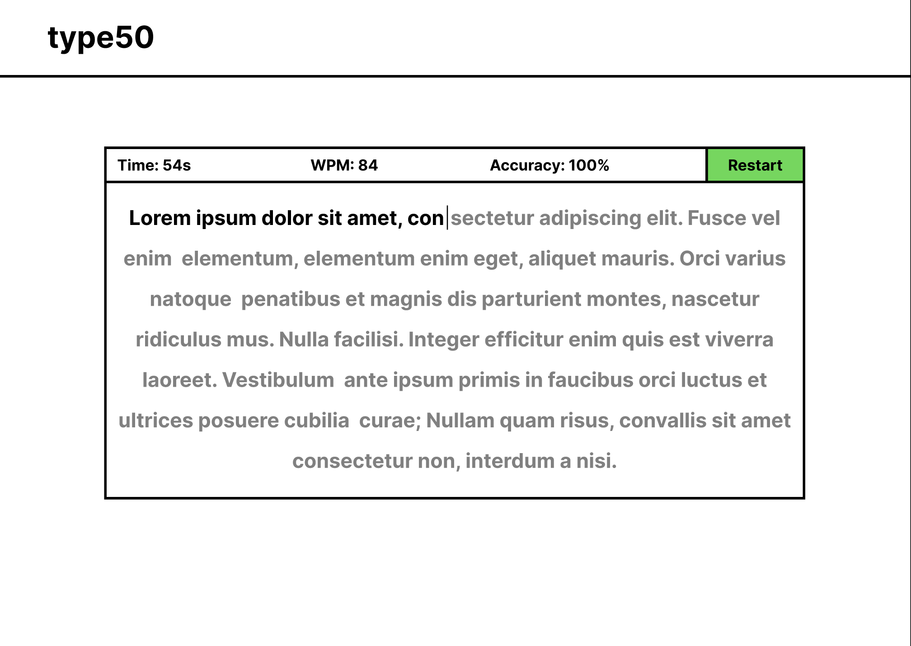

# The Design of type50

First off, I knew that I wanted to make some time of game (or "game-like" project) that heavily involved typing. After thinking things through, I decided I wanted to make it about procrastination, as I often found myself procrastinating on things by going on typing websites (like Monkeytype or TypeRacer). I wanted the project to be such that, at first, it would seem like just a normal typing website, like the ones mentioned earlier, but at some point, things would start act off and the story would progress there, with you acting as the procrastinating player. So, with this in mind, I now needed to decide how exactly I would implement this project, starting with the tech stack I would use. Since this was supposed to be like a game, but it was also going to be like a typing website, that left me with a decision: do I use a game engine, like Godot, or do I simply use a web development tech stack, likely involving HTML, CSS, and Javascript? In the end, I decided to go with the web development route, as I had already gained experience with software/web development through some of the CS50 psets, as well as through my involvement in T4SG, where I improved my HTML, CSS, and Javascript skills and learned how to use React, Tailwind CSS, and Next.js. So, I went with using HTML, CSS (Tailwind CSS), and Javascript (which included React, Next.js, and the Material UI component library).

Now, with this starting foundation, I would need to figure out how I would design the game/website. To do this, I designed a simple wireframe in figma, which would help me get an idea of how my project would look like:

As you can see, it looks quite similar to the project's current state. From this, I began programming the project. Given that I was using React, I needed to think about how I would split up the components (parts) of my project. Ultimately, I found that my project consisted of two main parts, the header/"navbar", and the actual typing area; within the header, there would be the title of the project, and within the typing area, there would be the stats bar, which included the live typing stats (as well as the restart button) and the actual area where the user could type in the given quote. From there, I went about designing each of these components, using separate .tsx files to create some modularity and development clarity while building this project. Throughout my designing of these components, I would make great use of the Material UI component library, where, through this, I would be able to design visually-effective components for the project. Overall, the project ends up running on one main page (page.tsx) composed of multiple components (Header.tsx, StatsBar.tsx, TextBox.tsx, TypingTest.tsx).

Now, I needed to work out how to generate quotes for the user to type. To do this, I used an API (QuoteSlate), where I could fetch random quotes on command. Now, I could fetch a quote, and display it for the user to type. Now, I also wanted it so that there were "story quotes," which would serve as the "story" part of my project. So, the project works my first presenting the user with a random quote as expected, but then, for the next few quotes, they are specifically given by the project itself, where the user would have to progress through these quotes to go back to the normal API random quote generation.

Lastly, I wanted to make the project responsive and satisfying to use and play around with. To do this, I wanted to make sure that the typing experience was high-quality. So, I implemented a moving cursor/caret, which indicated, to the user, the position they were currently at for the quote. Additionally, I implemented a system to display user mistakes, using red text or spaces for the respective incorrect input. Also, in order to allow for a keyboard-only experience, without having to use the "Restart" button, I added functionality to where with the "Tab" or "Enter" key (depending on the situation), you would also be able to generate new quotes/progress through the "story quotes." Finally, I also was able to add a sort of "pause" functionality by making it so that when you click somewhere off of the text area (that isn't the "Restart" button) it would essentially pause your given quote typing session, which includes a lack of cursor visibility and the pausing of live stat calculation.

All in all, I set out to make a storybased typing-based game, and in the end, I was able to make more of a general typing application, with a hidden "story" of sorts that the user could play through by using the already-established typing test functionality.

